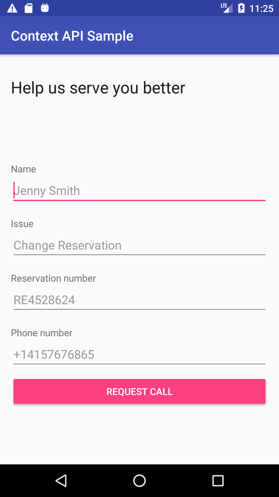

# Callback API Android Sample 

This is a sample Android application that exemplifies how to gather information from within an application and send that information to the **Callback API** and originate a callback. More information on this API can be found on the [Callback API](https://docs.talkdesk.com/docs/callback-api) documentation page.

## Basic Use Case

The main goal of the application is to collect the following information:

As Context:

* The user **Name** 
* The **Issue** 
* The associated **Reservation number** with the issue

Callback API Callback Arguments:

* The callback **Phone Number** (mandatory)
* **Talkdesk Number** (provided by the App)

For this, a simple Activity (`SampleActivity.kt`) requests this information and builds the Context Fields. For each of these fields extra information is added:

| Field Property | Description                                                  |
| -------------- | ------------------------------------------------------------ |
| Name           | An unique identifier for this field                          |
| Display Name   | A Human-readable name for the field                          |
| Tooltip Text   | An informative help text that can be shown as a tooltip *on the Agent interface* |
| Data Type      | The type of this field (one of: `phone`, `text`, `url`)      |
| Value          | The value (a `String`). If the type is  `url`, it should be a valid **URI**. A field of type `phone`  should be in the [E.164](https://en.wikipedia.org/wiki/E.164) format. |

## Authentication

The application requires an access token to contact the Callback API - see [Authenticating your Requests](https://docs.talkdesk.com/docs/authenticating-requests) on how to authenticate requests to the Callback API.

In this example the access token is used to contact the Callback API. This access token should be provided by the application backend, as described in detail in  [Using a Signed JWT](https://docs.talkdesk.com/docs/using-a-signed-jwt). The required scope to access this API is `callback:write`.

## How to run

In order to run this sample against the Context API you need to provide the next properties by inserting them into **gradle.properties** file.
- **TALKDESK_AUTH_TOKEN** - A Talkdesk ID authorization token with the correct scope. This should be obtained via Talkdesk ID.
- **TALKDESK_PHONE_NUMBER** - This is the phone number that should perform the call. It must be a number in your account.

After that you are able to press the **Run button**.
